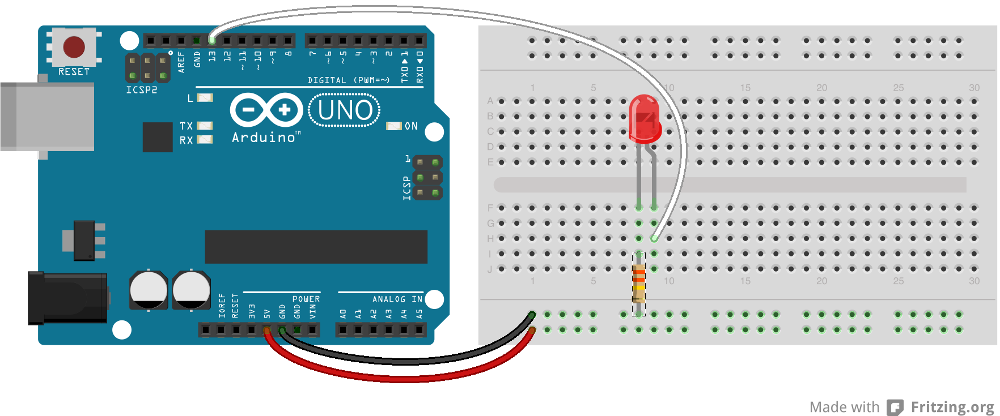

# Lesson 1a: Blink

For our first lesson, we will start out blinking an led using the Arduino. Through this, we will learn about declaring variables, constants, assigning pin modes, writing digital outputs, and using delays.

## Variables

A variable is a place to store data. A variable has a name, a type, and a value.

```int counter = 0;```

The example above describes an Integer type with a name of "counter" and a value of 0. Integers on the Arduino UNO store 16 bit values which gives a range of -32,768 to 32,767. In later lessons, we will also be using the type "long".

```long lastTimeMillis = millis();```

Here, we are declaring a variable named "lastTimeMillis" of type "long", and assigning it a value returned by the millis() function. Long variables store 32 bit values with a range of -2,147,483,648 to 2,147,483,647. Use the "long" type when the range of an "int" isn't enough.

Another variable type we will be using is "boolean". A "boolean" variable can have a value of true or false. When comparing variable values, 0 evaluates to false and 1 or another non-zero value evaluates to true.

## Constants

A variable, as the name implies, can change value. However, there are times when this isn't desirable. If you need a variable to remain constant, it should be preceded by the "const" keyword.

```const int ledPin = 13;```

Here, we declared an "int" named "ledPin", with a value of 13, which we don't want to change. If you attempt to modify a "const" variable, you will receive a compilation error.

## Assigning Pin Modes

The Arduino UNO has 20 I/O pins. These pins can be configured inputs or outputs using the function ```pinMode()```. Set the mode of a particular pin as follows:

```pinMode(pin, INPUT);``` or ```pinMode(pin, OUTPUT);```

By default, the pins are configured as inputs, but it is still a good idea to set the mode for the pins you are using in your sketch. Notice the use of the constants 'INPUT' and 'OUTPUT'.

## Setting a Digital Output

Once a pin is configured as an output, you can write a digital value to that pin. A digital value means that you are writing a 0 or 1. For the Arduino, this means a value of approximately 0 volts for 0 or 5 volts for 1 will be set on the output pin. To set a digital output, use the ```digitalWrite()``` function as follows:

```digitalWrite(pin, HIGH);``` or ```digitalWrite(pin, LOW);```

Here, notice the use of the constants 'HIGH' and 'LOW'. To achieve these output values, the Arduino uses internal pull-up and pull-down resistors.

## The Delay Function

As described in the intro lesson, the Arduino loop() function continuously executes. This happens very quickly and if we were to turn an led on and off without waiting for a bit, we would never see the blink.

To pause for a period of time, we can use the ```delay()``` function as follows:

```
delay(1000);
```

The delay above will last for 1000 milliseconds which is equivalent to 1 second.

## Assignment 1a

Use the things we learned in this lesson to blink an led using pin 13 as an output. To blink the led, set the output pin to 'HIGH' for a second, then to 'LOW' for a second. Use the circuit diagram below, which we will discuss when you are complete.




# Lesson 1b: Blink with Serial Monitoring

The Arduino environment has a built-in serial monitor that we can send data to from our Arduino sketch. This is a very useful feature for debugging, which is why we want to learn about it now.

To enable serial data to be sent or received, we will use the ```Serial``` library. For our beginner level class, we will be using two functions: ```begin()``` and ```println()```.

To initialize serial communication make the following call in the ```setup()``` function of your sketch.

```
Serial.begin(9600);
```

This will start start serial communication at a data rate of 9600 bps. Once initialized, you can send serial data as follows:

```
Serial.println("Hi from my Arduino sketch.");
```

When you run your sketch, you can click on the magnifier icon in the upper right corner to open the serial monitor and view the messages that are being sent.

## Assignment 1b

Update your previous blink code to include include messages that tell when the led is turned on or off. No changes to the circuit are required for this assignment.


Copyright © 2013-2014 Turner Logic, LLC
