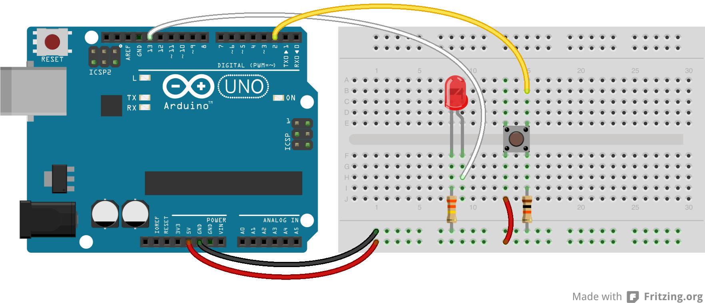

# Lesson 3: Blink via Button Toggle Debounced

In this lesson, we will be utilizing a concept called debouncing to make our sketch from lesson 2 work better. Debouncing means reading an input multiple times over a short period to make sure the input isn't fluxuating, before determining the proper current state. This is useful with push button switches because circuit noise is generated as the internal contacts touch or seperate which may cause undesired results. Using the concept of debouncing will allow us to remove the ```delay()``` from our code and make things work like they should.

## What time is it?

We are going to need to use a new function, ```millis()```, that will help us with relative time calcuations. This function doesn't take any parameters and returns the number of milliseconds since the Arduino board started running your sketch. This value resets back to zero after about 50 days due to a variable overflow, but it will be great for what we need here. Use the function as follows:

```long lastStateChange = millis();```

Notice that we are using the type 'long'. That is because the ```millis()``` function return value gets too big for an 'int' to hold. After we have recorded a time as shown above, we can use it to do comparisons with the current time to see how many milliseconds have elapsed.

```if (millis() - lastStateChange > 50)```

Here, we check to see if it has been at least 50 milliseconds since the last state change time we recorded. This will be important in the assignent.

## Assignment 3

The code for this lesson will be much more complex that previous lessons. You will need to track things like buttonState, lastButtonState, and lastChangeTime. The templated sample code should help. The circuit for this lesson is the same as lesson 2.




Copyright © 2013-2014 Turner Logic, LLC