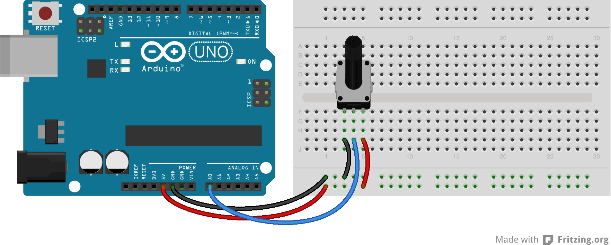

# Lesson 4a: Analog Input with a Potentiometer

Up to this point, all the signals we have been working with have been digital. Now we are going to start working with analog signals. We will learn about the difference between analog and digital signals, and how to read analog signals.

## Analog vs Digital

So, we already know that a digital signal is either a 0 or 1. Well, analog signals for the Arduino can be anything in the range of 0 to 5 volts. The question is, what do analog input voltages look like when read by the Arduino?

## Reading Analog Inputs

The Arduino has a device called an analog-to-digital converter built it. This device takes analog signals and converts them into something we can work with in the digital world. The A/D converter in the Arduino UNO has a 10 bit resolution, which means that a value from 0 to 1023 may be returned. So, an analog signal of 0 volts would be a 0 and something around 5 volts would be about 1023.

To read an analog input, we will have to use the A0-A5 pins on the Arduino UNO, that are labelled as ANALOG IN. This is because these are the pins that are connected to the internal A/D converter.

To read an analog input, we need to use a new function, ```analogRead()```. Just pass in the pin number and you will get back a value.

```int sensorInput = analogRead(sensorPin);```

## Assignment 4a

Use a potentiometer as a voltage divider to generate a voltage between 0 and 5 volts that is sent to the Arduino as an analog input. Read the input value and print the results to the serial monitor. Use the circuit diagram below.



# Lesson 4b: Analog Input with a Potentiometer 2

In this lesson, we will be using a new function, ```map()```.

### The map() Function

The ```map()``` function provides a useful way to convert data between different scales. For example, a full range analog input could be anything between 0 and 1023. But what if we really just want a number between 0 and 10. We could certainly do some math and get the results we want, but that is what the ```map()``` function is for.

```int convertedValue = map(readValue, 0, 1023, 0, 10);```

In the example above you can see that we pass in a value we read, followed by the low to high of the input scale, followed by the low to high of the scale we are converting to.

## Assignment 4b

Use the ```map()``` function to convert the potentiometer input values to a scale of 0 to 10. Also, make sure that the output is only printed to the serial monitor if it has changed since the last reading. No changes to the circuit are required for this assignment.


Copyright © 2013-2014 Turner Logic, LLC