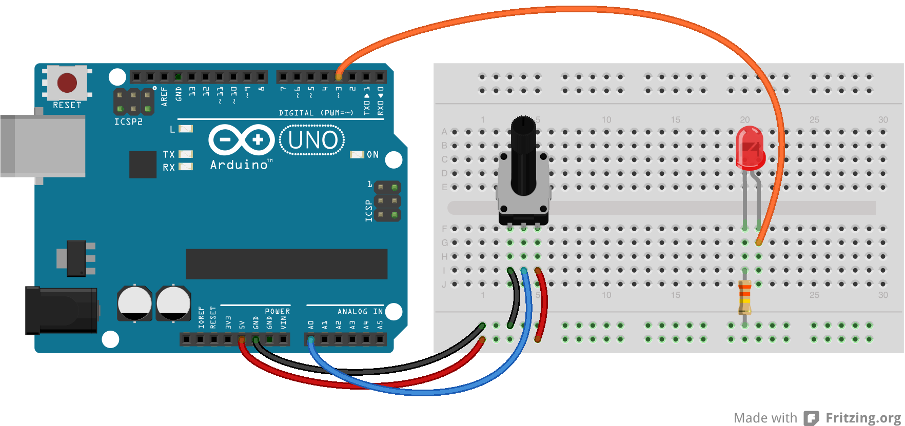

# Lesson 5: Potentiometer Controlled LED

Now that we have learned about analog inputs, it is time to learn about analog outputs. In this lesson we will learn how to write analog output values. Wait, how can the Arduino output analog signals if it is a digital device? Good question, and the answer is pulse width modulation.

## Pulse Width Modulation (PWM)

PWM allows us to generate what looks like an analog signal, digitally. This is accomplished by outputting square waves (0 or 1) very quickly over set time intervals. The longer the input is 1 per time interval, the closer to 5 volts the output will appear. Inversely, the shorter the input is 1 per time interval, the closer to 0 volts the output will appear. This high time (when the output is 1) relative to the time interval length is called duty cycle.

Sometimes a picture is worth a thousand words...


Further reading: [http://arduino.cc/en/Tutorial/PWM](http://arduino.cc/en/Tutorial/PWM)

## Writing an Analog Output

Now that we have a basic understanding of how a digital device like the Arduino can generate an analog signal, let's learn how to write the signal to a pin. We will be using a new function, ```analogWrite()```.

```analogWrite(pin, outputValue);```

By this time, you are probably able to guess the name of the function just by the task it is performing. That is definitely something to appreciate about Arduino. In the example above, the passed in output value will be written to the specified pin.

We need to remember a couple things about writing analog values. First, the analog output range for the Arduino UNO is 0 to 255. The next thing to remember is that you should be using a pin with a ~. The pins labelled with a ~ are connected to the internal square wave generator.

## Assignment 5

Use the things we learned about writing analog outputs to control the brightness of an led by expanding on the circuit built in the last lesson. The changes are shown in the circuit diagram below.



Copyright © 2013 Gizmovation, LLC