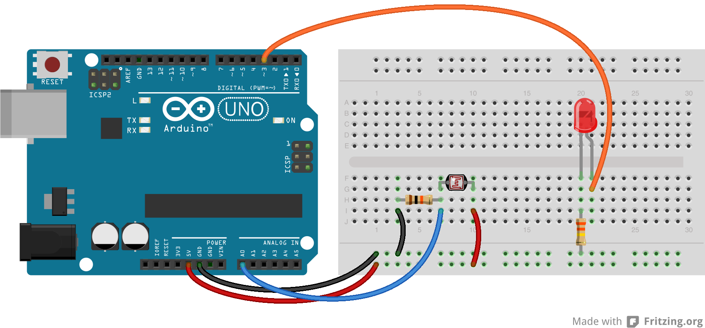

# Lesson 7a: Night Light

In this lesson, we will be learning about photo resistors. Photo resistors have a variable resistance determined by the amount of light received by the sensor.

## Voltage Dividers

We have been using voltage dividers in previous lessons, but we haven't really talked about them much. By connecting the middle pin of a potentiometer to an input on the Arduino, we have been able to read a variable voltage based on the resistance value. We can do this because a potentiometer has two resitors connected in series.

The photo resistor is just a single resistor. In order to make a voltage divider, we will need another fixed resistor in series with it. Preferrably, the fixed resistor value will have a resistance close to that of the photo resistor. Differences will be made up by calibration within our sketch.

Additonal Reading: [http://en.wikipedia.org/wiki/Voltage_divider](http://en.wikipedia.org/wiki/Voltage_divider)

## Assignment 7a

Read analog values from a photo resistor and output an analog value to an led using the read value. The led should be bright when the photo resistor senses low light, and dim or off in abundant light. Use the circuit diagram below.

# Lesson 7b: Night Light 2

Up to this point, we don't really have a night light. More like variable light output based on sensed light levels. Let's make a real night light.

## Assignment 7b

Modify your sketch so that the led turns either fully on or fully off based on a set threshold light level.

Copyright © 2013-2014 Turner Logic, LLC