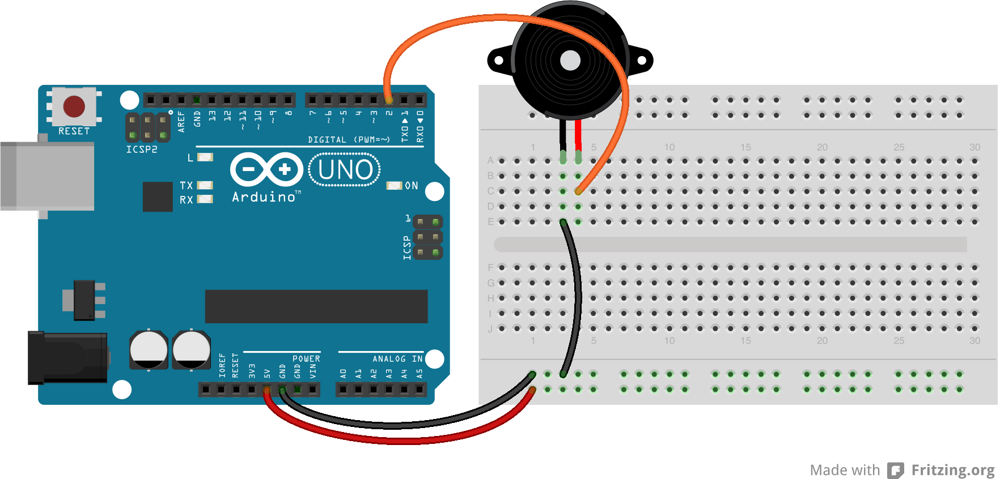

# Lesson 9: Making Music

In this lesson, we will be experimenting with a small buzzer and also learning some new functions for generating tones. We will also be learning about arrays and for loops.

## Generating Tones

Conveniently enough, the Arudino has some built in functions for tone generation. The functions we will be using for this lesson are the ```tone()``` and ```noTone()``` functions.

The ```tone()``` function takes in a pin, tone frequency, and duration (optional) and outputs a square wave at the specified frequency with a 50% duty cycle to the specified output pin.

There are some limitations and caveats with the tone function that can be read about here: [http://arduino.cc/en/Reference/Tone](http://arduino.cc/en/Reference/Tone)

As you may have guessed, the ```noTone(pin)``` function will stop a tone from being sent to the specified pin.

## Arrays

Arrays provide a way to store a list of values. For this lesson, we will need a series of tones to be played in a particular order. An array is a perfect way to store this data. Declare an array of Integers as follows.

```int melody[] = { tone1, tone2, tone3 };```

Notice the addition of the square brackets after the variable name. This designates to the compiler that the variable is an array. To initialize the array with values, we use curly braces with comma separated values.

The array in the example above has a length of 3. Arrays are 0 based, so the first element is actually numbered 0, and the last is numbered 2. To access the first value in the array, we would do the following:

```int tone1 = melody[0];```

## For Loops

For loops allow us to iterate over the values in an array. In this lesson, we need to be able to play tones in a sequence. To achieve that, we will iterate over the melody array and call the ```tone()``` method for each note.

```
for (int thisNote = 0; thisNote < 3; thisNote++) {
	tone(buzzerPin, melody[thisNote], noteDuration);
}
```

Notice the structure of the for loop statement. It starts out with a variable declaration, followed by a check to determine if the loop should continue, followed by code that should be executed after each iteration. The code ```thisNote++``` is the same as saying ```thisNote = thisNote + 1```.

## Assignment 9

Use the things we learned about array, for loops, and tones to build a simple tone playing circuit. Don't worry, the code template already has the melody defined. However, you will have to do some thinking about note durations. The circuit diagram is shown below.



Copyright © 2013 Gizmovation, LLC